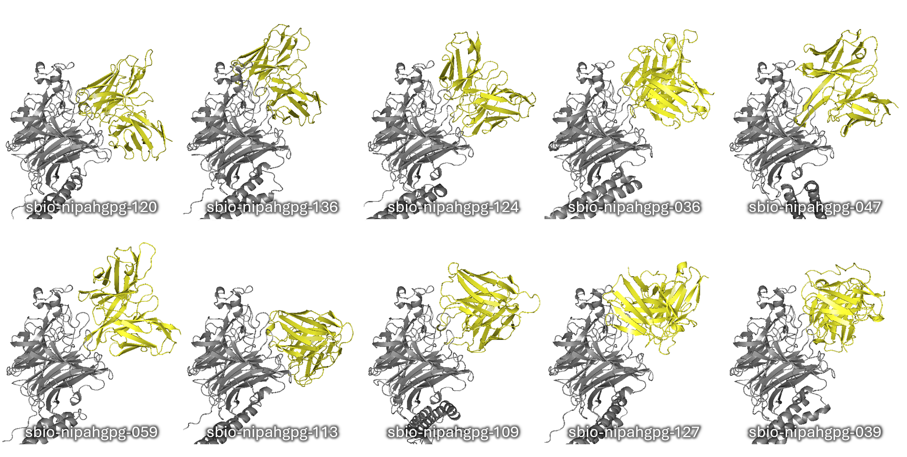

# AI-Generated Novel Antibodies Targeting Nipah Virus Glycoprotein G

<h3 align="right">Silico Biosciences</h3>

## Abstract

Nipah virus (NiV) is a highly lethal zoonotic pathogen whose Glycoprotein G (gpG) mediates viral attachment to human Ephrin-B2/B3 receptors, enabling infection of respiratory and neural tissues. Because no licensed vaccines or therapeutics exist for humans, gpG is a critical target for antiviral intervention. In this study, we aimed to design high-affinity antibody-like binders capable of blocking or disrupting the gpG interaction with its native receptors. Our approach focused on generating and evaluating candidate binders using our [🦋 peleke-1](https://github.com/silicobio/peleke) suite of antibody language models, optimizing for epitope binding affinity. These results provide promising scFv candidates along with insights into binder architectures and interaction motifs that may inform future development of therapeutic antibodies for Nipah virus outbreaks.

>[!Note]
>This project was part of the [Nipah Binder Competition](https://proteinbase.com/competitions/adaptyv-nipah-competition) hosted by Adaptyv Bio on [Proteinbase](https://proteinbase.com/).
>
> You can see all of the submitted scFv binders and their metrics on Proteinbase: https://proteinbase.com/silicobio

## Resources: 

- Candidate sequences and metrics: [candidates.xlsx](candidates.xlsx)
- All generated scFv structures (from Boltz-2) using the full gpG sequence: [data/candidates/structures_boltz2_frankenchain](data/candidates/structures_boltz2_frankenchain)
- All generated scFv structures (from Boltz-2) using the gpG extracellular domain (as used in the competition) sequence: [data/candidates/structures_boltz2_frankenchain_comp](data/candidates/structures_boltz2_frankenchain_comp)

> [!TIP]
> Learn more about this project on our website: [https://www.silico.bio/targets/nipah-gpg](https://www.silico.bio/targets/nipah-gpg)